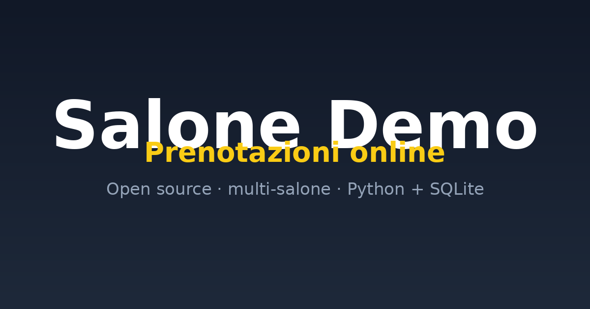
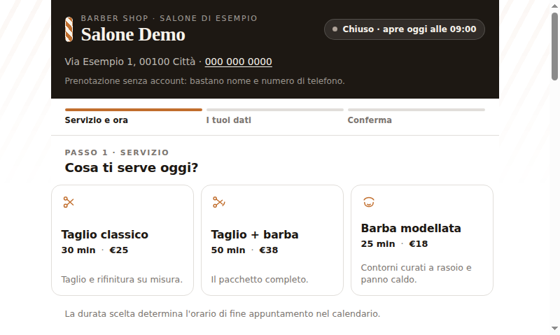

# Prenota Salone — online booking for barbershops & salons

[](https://github.com/fladnaG86/prenota-salone/actions/workflows/docker-publish.yml)


A tiny, self-contained **multi-tenant online booking app** for barbershops and
hair salons. One Python file (stdlib only) + SQLite serves the web app **and**
the JSON API. No framework, no build step for the backend, no external services
required (email is optional).

Each salon gets its own subdomain: `salone-a.example.com`, `salone-b.example.com`,
all from **one** deployment and **one** SQLite file.





## Why it exists

Small salons usually don't have a booking system: they take appointments by
phone or DM, and lose clients when nobody answers. This is a drop-in page they
can put on their phone / Instagram bio, where clients book themselves — evenings
and Sundays included. No app to install for the client, and the appointment goes
straight into their phone calendar.

## Features

- **Multi-tenant** — many salons from one instance, resolved by subdomain
  (`<slug>.domain`) or by `?salon=<slug>`; unknown slugs fall back gracefully.
- **Client side (no login)** — pick a service, a day and a free slot, leave a
  name and phone; the appointment is confirmed instantly.
- **Concurrency-safe** bookings: an atomic SQLite transaction + a
  duration-aware capacity check, so two clients can't grab the same slot.
- **Owner panel** (`/panel`, one passcode per salon) — view, reschedule and
  cancel bookings; login rate-limited, session cookie is HMAC-signed.
- **Italian / English interface** — a flag button in the top-right corner
  switches the whole booking page instantly, with no reload. The choice is
  remembered in `localStorage` and pre-selected from the browser language on the
  first visit. (The owner panel, the emails and the privacy notice are still
  Italian only.)
- **Confirmation email with a calendar invite (`.ics`)** — the client taps once
  and the appointment lands in their **iPhone or Android calendar**, with a
  reminder 2 hours before. No app to install, nothing to type by hand. The
  booking still succeeds when email is not configured.
- **Ricevuta di avvenuta prestazione, in automatico** — quando il barbiere
  chiude la prestazione, il cliente riceve subito una ricevuta **non fiscale**
  (importo + come pagare: IBAN, PayPal o in salone) e il salone riceve la
  notifica del **pagamento in sospeso**, con il totale da incassare nel pannello.
- **GDPR-friendly** — a ready privacy page, explicit consent checkbox, minimal
  data collected.
- **Hardened by default** — rate limiting, capped request sizes, HTML escaping,
  banner-injected `og:` tags for WhatsApp/social previews, secrets from env only.

## Quickstart

Requires **Python 3.8+** (standard library only) and a modern browser.

```bash
git clone https://github.com/<you>/prenota-salone.git
cd prenota-salone

# optional but recommended: your own secrets
export BARBERIA_PANEL_SECRET="$(python3 -c 'import secrets;print(secrets.token_hex(32))')"
export BARBERIA_ADMIN_TOKEN="$(python3 -c 'import secrets;print(secrets.token_hex(32))')"

python3 srv.py
```

Open <http://localhost:8899/> — you'll see the **Salone Demo** tenant.
Owner panel: <http://localhost:8899/panel> (demo passcode **`demo1234`**).

The whole configuration lives in two JSON files at the repo root:

- `salons.json` — the tenants (`slug`, `name`, address, services, opening hours…).
- `panel_users.json` — one hashed passcode per salon.

> The demo passcode `demo1234` is public on purpose. **Always change it** before
> going live: hash a new one with `python3 panel_hash.py <slug> <new-code>`.

## Configuration (environment variables)

All optional; sensible defaults. Secrets are **never** in the source.

| Variable | Meaning |
|---|---|
| `BARBERIA_PORT` | listen port (default `8899`) |
| `BARBERIA_HOST` | bind address (default `0.0.0.0`) |
| `BARBERIA_DB_PATH` | SQLite path (default `./bookings.db`) |
| `BARBERIA_LOG_PATH` | log file, or `stdout`/`-` to log to stdout (default `./server.log`) |
| `BARBERIA_SALONS_JSON` | tenants file (default `./salons.json`) |
| `BARBERIA_PANEL_USERS` | passcodes file (default `./panel_users.json`) |
| `BARBERIA_RETENTION_DAYS` | booking retention (default `730`) |
| `BARBERIA_PANEL_SECRET` | HMAC key for panel session cookies |
| `BARBERIA_ADMIN_TOKEN` | token for the admin `GET /bookings` endpoint |
| `BARBERIA_SMTP_HOST` / `_PORT` / `_LOGIN` / `_PASSWORD` | optional email sending |
| `BARBERIA_AUTO_RECEIPT` | `1` closes finished bookings on its own and sends the receipts (default `0`) |
| `BARBERIA_AUTO_RECEIPT_GRACE_MIN` | minutes after the end of the service before auto-closing (default `15`) |
| `BARBERIA_OG_DIR` | folder with `og/<slug>.png` social banners |
| `BARBERIA_SLUG_REDIRECTS` | JSON of `{"old-slug":"new-slug"}` → 301 redirects |

See `.env.example`.

## Adding a salon

1. Add an entry to `salons.json` under `salons` (copy an existing one).
2. Generate its passcode:
   ```bash
   python3 panel_hash.py <slug> 'la-tua-password'
   ```
   and put the printed hash into `panel_users.json` under the same slug.
3. *(optional)* drop `og/<slug>.png` (1200×630) and `og/<slug>-logo.png`.
4. Restart the service.

## Receipt after the service (ricevuta di avvenuta prestazione)

When the barber closes an appointment (`Completa` / `Chiudi e incassa` in
`/panel`), the app **automatically** sends:

1. **to the client** — a *non-fiscal* receipt (`Documento non fiscale, non
   valido ai fini IVA o fiscali`): service, barber, date, **amount** and the
   payment instructions, i.e. **IBAN** (with account holder), **PayPal** link,
   Satispay or payment in the salon, plus the booking code as payment reference.
   The same receipt is attached as a `.txt` file.
2. **to the salon** (`notify_email`) — a notification saying the payment is
   **pending** (`da incassare`) with amount, client and service.

Then `Segna incassata` marks the payment as received; the panel header always
shows how much is still pending. `Reinvia ricevuta` resends it if SMTP was down.

### Payment details per salon

Fill the `payment` block in `salons.json` (or in `defaults` to share it):

```json
{
  "slug": "il-mio-salone",
  "name": "Il Mio Salone",
  "piva": "P.IVA 01234567890",
  "notify_email": "info@ilmiosalone.it",
  "payment": {
    "methods": "Contanti, bancomat o carta in salone",
    "iban": "IT00X0000000000000000000000",
    "holder": "Il Mio Salone di Mario Rossi",
    "paypal": "https://paypal.me/ilmiosalone",
    "satispay": "",
    "note": "Indica il codice prenotazione nella causale."
  }
}
```

Every field is optional: what is empty simply is not shown. `paypal` accepts a
full URL (`https://paypal.me/...`), a handle (`ilmiosalone`) or an email address.
Leave the fields empty if you don't want them in the receipt — the amount and
"da pagare" are always included.

> The receipt is **not** a fiscal document: it is only a confirmation that the
> service was performed, with an amount to settle. Enable `BARBERIA_AUTO_RECEIPT=1`
> if you want the app to close finished appointments by itself (default: the
> barber closes them from the panel).

## Tests

```bash
python3 -m unittest discover -s tests -v
```

The suite starts the real HTTP server in-process with a temporary SQLite file and
a stubbed SMTP, so it covers the whole flow (booking → closing the service →
receipt to the client + pending-payment notice to the salon) without sending any
real email.

## Deploy

### Docker (quickest)

A prebuilt image is published to GitHub Container Registry on every release:

```bash
docker pull ghcr.io/fladnag86/prenota-salone:latest
docker run -d --name prenota-salone -p 8899:8899 \
  -v prenota_data:/data \
  -e BARBERIA_PANEL_SECRET="$(openssl rand -hex 32)" \
  -e BARBERIA_ADMIN_TOKEN="$(openssl rand -hex 32)" \
  ghcr.io/fladnag86/prenota-salone:latest
```

Or build it yourself:

```bash
docker build -t prenota-salone .
docker run -d --name prenota-salone -p 8899:8899 \
  -v prenota_data:/data \
  -e BARBERIA_PANEL_SECRET="$(openssl rand -hex 32)" \
  -e BARBERIA_ADMIN_TOKEN="$(openssl rand -hex 32)" \
  prenota-salone
```

The image is `python:3.12-slim`, runs as a non-root user (uid 10001), keeps the
app files read-only and stores all state in the `/data` volume. Logs go to
stdout, so `docker logs -f prenota-salone` just works.

### Docker Compose

```bash
echo "BARBERIA_PANEL_SECRET=$(openssl rand -hex 32)" >> .env
echo "BARBERIA_ADMIN_TOKEN=$(openssl rand -hex 32)"  >> .env
docker compose up -d
```

`salons.json`, `panel_users.json` and `og/` are bind-mounted, so you can add a
salon or change a passcode and just restart — no rebuild. The DB lives in the
named volume `prenota_data`.

### systemd (no Docker)

A hardened unit is in `deploy/prenota-salone.service`:

```bash
sudo useradd --system --home /opt/prenota-salone --shell /usr/sbin/nologin prenota
sudo mkdir -p /opt/prenota-salone /var/lib/prenota-salone
sudo cp srv.py app.js index.html panel.html privacy.html salons.json panel_users.json /opt/prenota-salone/
sudo cp -r og /opt/prenota-salone/
sudo chown -R prenota:prenota /opt/prenota-salone /var/lib/prenota-salone
sudo install -m 600 /dev/null /etc/prenota-salone.env   # then edit it (secrets)
sudo cp deploy/prenota-salone.service /etc/systemd/system/
sudo systemctl enable --now prenota-salone
```

The unit sets `ProtectSystem=strict`, `NoNewPrivileges`, `UMask=0077` and only
grants write access to `/var/lib/prenota-salone`.

### nginx + wildcard subdomains

One server block with a wildcard `server_name` is enough — the app resolves the
tenant from the `Host` header, so there is nothing per-salon to configure. See
`deploy/nginx-prenota-salone.conf`. TLS: either a wildcard certificate
(`certbot ... -d yourdomain -d "*.yourdomain"`) or **Cloudflare Free** in front
(SSL/TLS mode **Flexible**, since the origin only speaks HTTP). DNS: `A @` and
`A *` → your server IP; proxy the per-tenant records too.

### Backup

Copy the single `bookings.db` plus `salons.json` and `panel_users.json`.
That is the entire state.

## Project layout

```
srv.py            backend: HTTP server + JSON API + tenant resolution + panel auth
App.jsx           frontend source (React 18, UMD, no bundler config)
app.js            transpiled bundle actually served  (esbuild App.jsx --outfile app.js)
index.html        client page (loads React UMD + app.js)
panel.html        owner panel
privacy.html      GDPR privacy notice template
salons.json       tenant configuration
panel_users.json  per-salon hashed passcodes
og/               social-preview banners (og/<slug>.png, og/<slug>-logo.png)
panel_hash.py     helper: hash a new passcode
Dockerfile        container image (non-root, /data volume, stdout logs)
docker-compose.yml  one-command local/VPS deploy
deploy/           systemd unit + nginx wildcard-subdomain example
```

To rebuild the frontend after editing `App.jsx`:

```bash
npx esbuild App.jsx --loader:.jsx=jsx --outfile=app.js
```

(or run any esbuild you already have; the server serves `app.js` as-is).

## License

MIT — see [LICENSE](LICENSE).

---

## Italiano

**Prenota Salone** è una piccola app di prenotazione online **multi-salone** per
barbieri e parrucchieri. Un solo file Python (solo libreria standard) + SQLite
serve sia la web app sia le API: nessun framework, nessun database esterno, nessun
servizio obbligatorio (l'email è opzionale).

Ogni salone ha il suo sottodominio (`salone-a.tuodominio.it`), tutto da **un solo**
deploy e **un solo** file SQLite.

Il cliente sceglie servizio, giorno e orario libero e prenota in pochi secondi,
senza installare niente; riceve un'email di conferma con l'appuntamento che si
aggiunge al calendario di iPhone o Android con un tocco (promemoria 2 ore prima).
Il titolare gestisce appuntamenti da `/panel`.
Le prenotazioni sono **sicure in concorrenza** (transazione atomica + controllo
capienza), e i dati raccolti sono minimi (pagina privacy GDPR inclusa).
L'interfaccia si passa da italiano a inglese con il tasto con la bandiera in alto
a destra (scelta ricordata; all'avvio segue la lingua del browser). Pannello,
email e informativa privacy sono per ora solo in italiano.

Avvio rapido: `python3 srv.py` → <http://localhost:8899/> (demo), pannello
`/panel` con codice **`demo1234`**. Licenza MIT.
